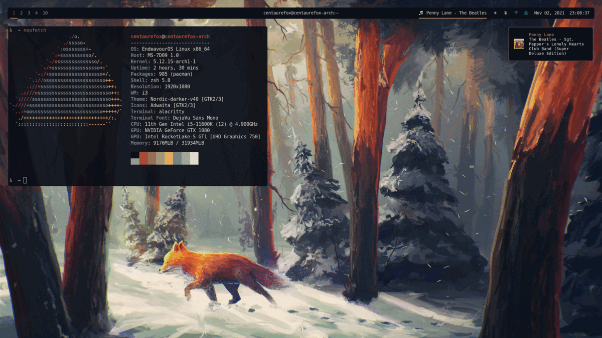
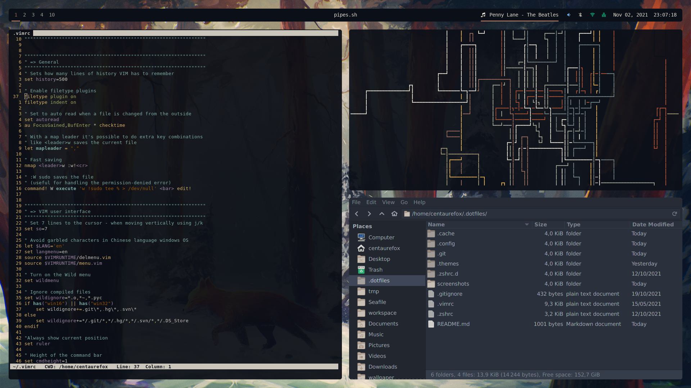

# Dotfiles

My dotfile repository containing everything needed for my i3 setup. I am currently using EndeavorOS (arch based) but it should work on other distro with minor modifications.

## What's in it?

- WM: i3-gaps
- Compositor: picom (ibhagwan's fork)
- Terminal: Alacritty  *Applications shown below are : vim, pipes.sh, thunar*

- Notifications: Dunst
- Launcher & Powermenu: Rofi

- Status bar: polybar, with Nerd Fonts Hack
- File manager: Thunar, with Nordic darker theme
- Colors and theme management using pywal
- Basic dotfiles :
    - i3 config file
    - .zshrc and .zshrc.d
    - .vimrc
## Usage & Installation

For an easy way to install and use those dotfile, please check [ansible-dotfiles](https://github.com/BaptisteBdn/ansible-dotfiles).

## Notes
- Wallpapers can be found in `.config/wallpaper`.
- I tweaked some generated pywal schemes in order to have better results, in order to keep those changes I added the `.cache/wal/schemes` folder.
- This design is inspired by [k-vernooy](https://github.com/k-vernooy/dotfiles).